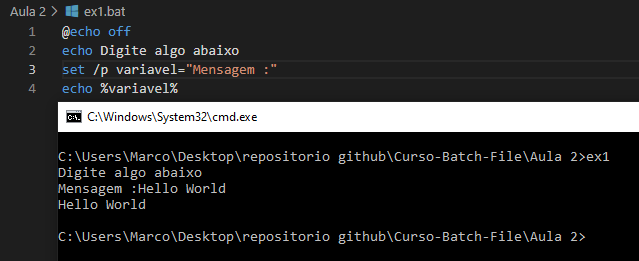
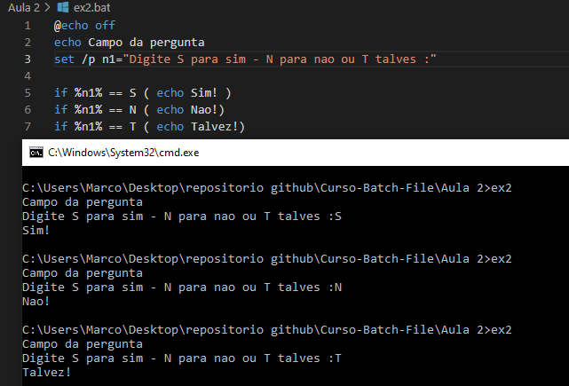
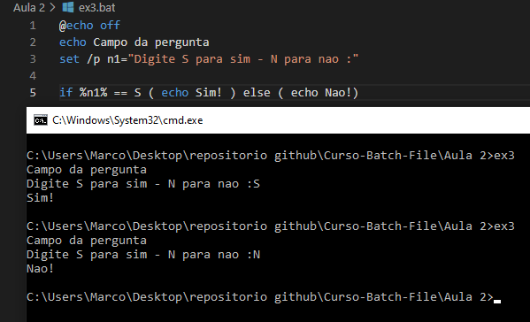
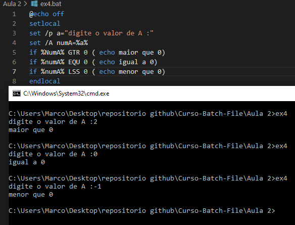

# Curso de Batch File - Aula 2

__Comando Set - Part 2__
O comando set ainda tem outra vantagem, a de capturar digitos do teclado, usando o comando:
set /p variavel="Mensagem a ser mostrada :"

*Exemplo ver ex1.bat*

__Comando if__
Comando usado para testar várias condições
*Exemplo ver ex2.bat*

__Comando if else__
Comando usado para testar ate 2 condições

__Parametros lógicos ou de testes__
Podemos usar parametros lógicos para nos ajudar na construção e obtenção de melhores resultados:

EQU – Igual a
NEQ - Não é igual a
LSS – Menor que
LEQ – Menor ou igual a
GTR – Maior que
GEQ – Maior ou igual a

Veja exemplo no arquivo ex4.bat

Por fim vou falar desses dois ultimos codigos que eu coloquer nesse exemplo:

__setlocal e endlocal__

setlocal e endlocal são parametros utilizados para delimitar a criação e o uso de variaveis, eles dizem ao windows "Daqui pra frente tudo que for criado será local e no fim essas variveis serão apagadas da memoria.

__Aceitando parametros externos__

Muitas vezes nosso batch terá que receber parametros extenos para isso temos os identificadores e são incluidos após se chamar a executavel:

__Código__|Identificação

%1 - Primeiro parametro após chamar a executável
%2 - Segundo parametro após chamar a executável
%3 - Terceiro parametro após chamar a executável

e assim por diante, para ser sincero numca testei até quantos parametros são aceitos dúvidas codigo em ex5.bat

