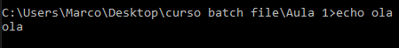
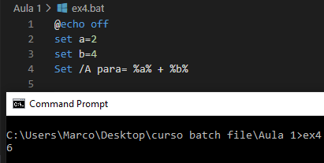
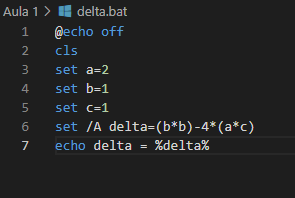

# Curso de Batch File - Aula 1

__<h3>O que são comandos BAT  ?</h3>__

Os comandos BAT são instruções dadas ao sistema operacional que serão executadas em lote ou batch (em inglês) pelo prompt de comandos do Windows, vou comecar por algo bem simples a cada comando a amostra de um exercicio e seu resultado ok.

<h3>comando</h3>
    @echo off - Esse codigo é utilizado para desativar a exibição dos comando na tela mostrando somente as mensagens.

Abaixo podemos ver o codigo do batch file ex1.bat onde não foi inicializado com o comando @echo off

Como saída terá o seguinte resultado:

Podemos verificar que apareceu o codigo "echo ola" e o seu resultado a palavra "ola" agora vejamos o resultado com o codigo @echo off.

Para reverter ao normal é só utilizar o codigo
@echo on

O proximo comando é o de exibir mensagem na tela e temos duas ressalvas

1. O usuário usa o comando anterior.

   * Então podemos usar o comando echo mensagem
2. O usuário não usa o comando anterior

   * Então ele é obrigado a usar o @echo mensagem

Obs: Caso ele não use acontecerá o mesmo problema como no código anterior.

<h3>Comando</h3>
SET
O comando SET é responsavel por atribuir valores a variaveis que podem ser usadas no script:
Exemplo ex3.bat

No código acima estou criando uma variável chamada numero e já estou atribuindo um valor a ela que é o numero 3.
Daí você me pergunta - Como eu vou saber que realmente foi criada essa variavel e esse valor foi incluído a ela?

Simples vamos apresentar o valor com o comando @echo, porém temos que entender que para que o valor da variavel seja apresentada devemos usar um marcador que vai dizer ao programa , essa é uma variavel.

Usamos entao o marcador %variavel%

Veja a imagem abaixo o codigo e o resultado

O comando set da forma como é utilizada acima não nos dá muitas possibilidades , porem podemos usar um identificador ao qual dará a possibilidade de realizar operacoes matematicas da seguinte forma: Ex4.bat

No exemplo acima criei 3 variaveis

1. a=2
2. b=4
3. para= %a% + %b%

Comando cls - ex5.bat
O comando cls é usado para limpar a tela
C:\>cls
Como exemplo de tudo que foi visto até agora vamos criar um batch file que calcule o delta:

